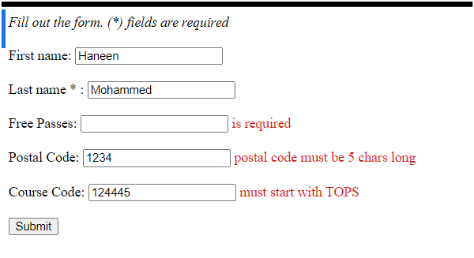
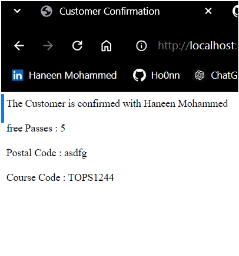
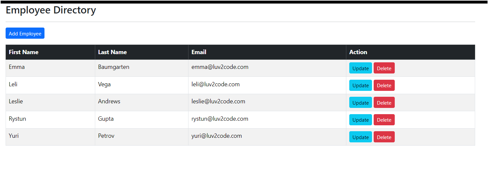
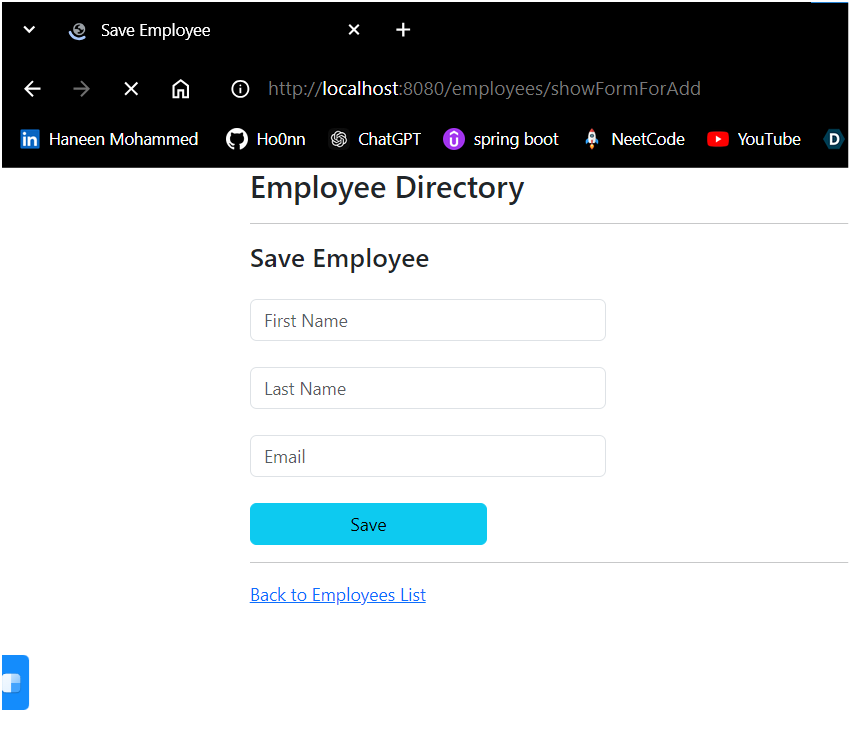

## 📌 What is Spring MVC ?

Spring MVC is a web framework that is part of the Spring Framework. It uses the Model-View-Controller (MVC) design pattern, which helps to organize code by separating the data (Model), the user interface (View), and the control logic (Controller). This makes it easier to manage and develop applications.

## Project Overview 🎯

In this project, I learned how to use Spring MVC to build a web application. I explored the Model-View-Controller (MVC) pattern, where controllers manage requests, views display data, and models hold the information. I also worked with Thymeleaf to create dynamic pages. This experience helped me understand how to organize a web app effectively.

## Features 🚀

MVC Architecture:
The MVC design pattern helps separate responsibilities in the application.

Controllers:
Controllers manage HTTP requests and link them to the right services.

View Resolvers:
View resolvers return the appropriate pages based on user requests.

Validation:
User input is validated using annotations to ensure data quality.

Integration with Thymeleaf:
Thymeleaf is used as a template engine for creating dynamic web pages.

<table>
  <tr>
    <td align="center">
      
       
      <strong>Validation Form</strong>
    </td>
    <td align="center">
      
       
      <strong>Welcome To Home Page!</strong>
    </td>
  </tr>
</table>
<table>
  <tr>
    <td align="center">
      
       
      <strong>Table Overview</strong>
    </td>
    <td align="center">
      
       
      <strong>Create & Update Operations</strong>
    </td>
  </tr>
</table>
